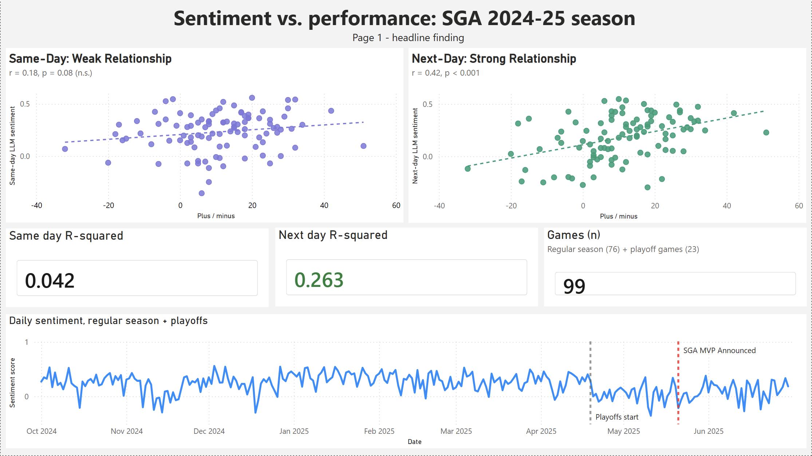
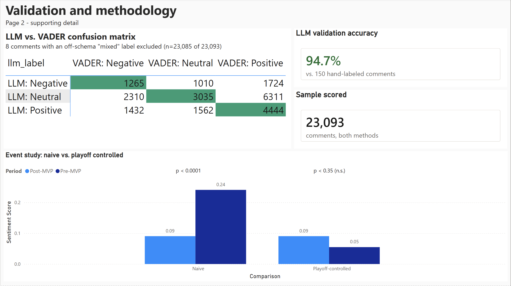

# Findings: SGA Reddit Sentiment vs. Performance (2024-25 Season)

## Overview

This project tests whether Reddit sentiment toward Shai Gilgeous-Alexander
(SGA) on r/nba tracks his on-court performance, across the Oklahoma City
Thunder's full 2024-25 season — the season in which SGA won both regular
season MVP and Finals MVP en route to a championship. It analyzes
7.18 million real r/nba comments (Oct 1, 2024 - June 30, 2025), a
stratified sample of ~23,000 SGA-mentioning comments scored for sentiment
by both a lexicon-based method (VADER) and an LLM (Llama 3.3 70B), and
SGA's full-season game logs.

The headline result: **The performance of a game strongly predicts next-day 
Reddit fan sentiment, but does not predict same-day sentiment**

---

## Data & Methodology

### Data sources
- **Reddit comments**: pushshift monthly archives (Academic Torrents),
  streamed and filtered to r/nba without full disk decompression
  (`scripts/filter_subreddit_streaming.py`). 7,180,862 comments loaded.
- **Game performance**: `nba_api`, SGA's full 2024-25 regular season +
  playoff game logs (`scripts/nba_stats_pull.py`).

### Sampling
A flat random sample of 7.18M comments would have wasted most of the
labeling/scoring budget on days with little SGA-specific discussion. A
stratified design was used instead (`scripts/stratified_sample_comments.py`):
- **Baseline**: up to 50 SGA-mentioning comments/day across all 273 days
  of the season window, for daily time-series coverage
- **Game-day boost**: up to 150 additional SGA-mentioning comments on
  each of the 99 actual game days, since those are the days the
  performance-correlation analysis depends on
- All sampling restricted to comments containing "SGA" or "Shai"
  (case-insensitive, word-boundary matched)
- Final sample: 23,093 comments (13,213 baseline + 9,880 game-day boost)

### Sentiment scoring
Two methods were run against the identical 23,093-comment sample

- **VADER**: lexicon-based, sentence-filtered to only the SGA-mentioning
  portion of each comment. Fast, free, but has no ability to determine
  *who* a comment's sentiment is actually about.
- **LLM** (Llama 3.3 70B via Hugging Face Inference Providers): given the
  full comment text and asked to classify both subject (`about_sga` /
  `not_about_sga` / `unclear`) and sentiment. This addresses VADER's
  blind spot - many comments mention SGA only in passing while the real
  sentiment is about a different player, a comparison, or the team.

**Validation**: a 150-comment sample was hand-labeled and used to
validate the LLM's classifications. The prompt went through several
rounds of refinement based on specific, real classification errors:
- Started at a 4-way subject schema (about/incidental/comparative/
  unclear), collapsed to 3-way after the LLM showed persistent
  difficulty distinguishing incidental from comparative
- An 8B model plateaued around 66.7% accuracy despite multiple rounds of
  targeted prompt fixes - diagnosed as a genuine model capability limit
- Upgrading to a 70B model with the same refined prompt reached 94.7%
  accuracy (142/150) against the hand-labeled set
- Remaining errors were a roughly even mix of both directions, consistent
  with residual, largely irreducible ambiguity rather than a fixable pattern

**Result of LLM scoring on the full sample**: 13,389 of 23,093 comments
(58%) classified `about_sga`, split 7,396 positive / 3,960 negative /
2,025 neutral - a clear positive skew, consistent with an MVP/
championship season.

---

## Statistical Results

All modeling in `scripts/statistical_modeling.py`, pulling from the
`daily_sentiment_and_performance` view (`sql/03_aggregation_queries.sql`).

### 1. Does game performance predict sentiment?

*Dashboard Page 1 — visualizing the headline finding from Section 1 below.*

**Same-day (naive): no detectable relationship.**
OLS of `points`, `plus_minus`, `win_loss`, `home_away` against same-day
LLM sentiment, n=99 game days: R-squared=0.042, F-test p=0.402. No
individual predictor reached conventional significance (`plus_minus`
closest, p=0.093, significant only at the 90% confidence
level).

**Next-day: strong, significant relationship.**
NBA games tip off 7-10pm local time, and comment timestamps are UTC -
meaning a large share of genuine post-game reaction likely lands on the
*following* calendar day, not the game's own day. 

Re-running the identical regression against next-day sentiment instead:
R-squared=0.263, F-test p=8.09e-06 (a ~6x jump in R-squared and a shift
from non-significant to highly significant). `win_loss` (p=0.018) and
`points` (p=0.043) both reached conventional significance, with
sensible signs - wins and higher scoring both predict more positive
next-day sentiment. `plus_minus` (p = 0.078) is significant at the 
$\alpha = 0.10$ level, with a positive coefficient. 

**Combining same-day and next-day performed worse than next-day alone**
(R-squared=0.114, all individual predictors losing significance) -
same-day comments diluted the signal rather than adding to it,
reinforcing that the timing mismatch, not noise in general, was the
specific problem with the naive same-day test.

**Robustness**: results held under Breusch-Pagan/White heteroskedasticity
tests (all non-significant, homoskedasticity assumption not violated)
and HC1/HC3 robust standard error refits (coefficients and significance
essentially unchanged from the standard OLS fit) across all three model
specifications.

**Interpretation**: the same-day null result was a measurement artifact,
not evidence of no relationship. Once sentiment is measured on a
timeline that matches when fans actually react, performance is a real,
statistically significant predictor of Reddit sentiment.

### 2. Is sentiment itself persistent day to day?

An ARMA(1,1) model on the full 273-day daily sentiment series converged
cleanly (no fallback to a simpler model needed): AR(1) coefficient =
0.935 (p<0.0001). Today's sentiment is a strong predictor of tomorrow's
- the daily conversation has real momentum, independent of whether it
tracks same-day box scores.

### 3. Did the MVP announcement (May 21, 2025) shift sentiment?

**Naive pre/post comparison: large, highly significant effect.**
Pre-announcement mean sentiment 0.24 vs. post-announcement mean 0.09,
Welch's t=-5.23, p<0.0001.

**This is confounded.** The MVP announcement landed in the middle of the
Thunder's playoff run, not a quiet stretch - the post-period is almost
entirely playoff games, while the pre-period mixes regular season and
non-game days. Playoff basketball generates more intense/critical
discourse independent of any specific award.

**Playoff-controlled comparison: effect disappears.**
Restricting the comparison to only days within the playoff window
(April 19 - June 30, 2025) and comparing pre- vs. post-announcement
sentiment *within that window*: mean 0.055 (pre) vs. 0.090 (post),
t=0.94, p=0.35 - not significant, and the direction even reverses
(sentiment went up slightly, not down).

**Interpretation**: the dramatic naive result was driven almost entirely
by the regular-season-to-playoffs discourse shift, not the MVP
announcement itself. A naive event study would have reported a false
positive here.

*Dashboard Page 2 — visualizing the validation accuracy and event study
confound comparison discussed above.*

### 4. Power analysis

The original single-month pilot (n=11 games) could only reliably detect
an almost deterministic relationship (R-squared above ~70%) - even a
conventionally "large" effect would have been missed the large majority
of the time, making any null result there uninterpretable. At the full
season's n=99 games, this design has 87-99.9% power to detect
medium-to-large effects (minimum detectable R-squared at 80% power:
11.3%), meaning the same-day null result (section 1) is a genuine
finding, not an artifact of insufficient power.

### 5. Does win/loss margin matter differently for wins vs. losses?

An interaction term (`win_loss x plus_minus`) testing whether blowouts
affect sentiment differently than close games depending on win/loss
direction was tested on both timings, with the same conclusion either
way: not significant same-day (p=0.58) or next-day (p=0.97). A
categorical blowout-vs-close breakdown suggested blowout losses might
correspond to the lowest mean sentiment of any group on both timings,
but that cell has only n=5 observations - far too small to trust as a
real finding. Unlike the main OLS result, this null holds consistently
regardless of measurement timing, suggesting it's a genuine absence of
an interaction effect rather than another timing artifact.

### 6. Bivariate correlations: same-day vs. next-day

Single-predictor correlations were run on both timings for direct
comparison, and the pattern matches the main OLS result closely:

| Predictor | Same-day r (p) | Next-day r (p) |
|---|---|---|
| `points` | -0.016 (p=0.875) | **0.290 (p=0.004)** |
| `plus_minus` | 0.176 (p=0.082, CI crosses zero) | **0.421 (p<0.001, CI [0.243, 0.571])** |
| `rebounds` | 0.067 (p=0.508) | -0.017 (p=0.868) |
| `assists` | -0.155 (p=0.125) | 0.048 (p=0.640) |

`plus_minus` next-day (r=0.421) is a genuinely strong correlation by
conventional standards - not just statistically significant but a
substantively meaningful effect size, invisible entirely on the
same-day timing. `points` shows the same pattern, moving from null to
clearly significant. `rebounds` and `assists` stay null on both
timings - the timing fix specifically rescues the scoring/margin
predictors, not every predictor indiscriminately, which is a good sign
this is a real effect and not some artifact that inflates all
correlations equally when switching timings.

---

## Known Limitations

- **VADER coverage**: this pipeline restricted VADER to the same 23,093-
  comment stratified sample as the LLM (a deliberate change from an
  earlier version of this project, which had VADER cover a much larger,
  differently-sized population) - this enables a clean method comparison
  but means there's no full-corpus VADER baseline series in this version.
- **Sarcasm and tone**: manually reviewed examples during LLM validation
  suggest the LLM handles sarcasm/backhanded compliments meaningfully
  better than VADER would (e.g. mockingly "positive" phrasing about
  repeated fouls/flopping), but this wasn't formally quantified - cited
  as an anecdotal observation, not a measured metric.
- **Multi-player-mention ambiguity**: the LLM's subject classification
  has a documented soft edge case around comments naming SGA alongside
  several other players (e.g. as one of many "equal co-subjects" of a
  claim vs. one example in an illustrative list) - see prompt comments
  in `llm_stratified_scoring.py` for the specific rule and its rationale.
- **PLAYOFF_START_DATE**: verified against actual data (April 19, 2025)
  for this analysis, but worth re-confirming if this pipeline is ever
  re-run against a different season.
- **Correlational, not causal**: all relationships reported here are
  correlational. The next-day timing result is a strong, robust
  correlation; it does not establish that performance *causes* sentiment
  shifts (though this is the substantively plausible direction) versus
  some other explanation.
- **Single-season, single-player**: findings are specific to SGA's
  2024-25 season and should not be assumed to generalize to other
  players, teams, or seasons without independent testing.
